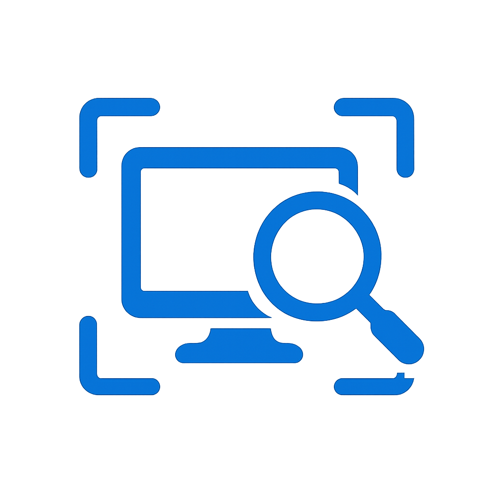

# AccessScan

## Introdução

Este repositório tem como propósito fornecer um checklist prático de acessibilidade para projetos, principalmente de desenvolvimento de software, que incluem: desenvolvimento web, design, geração de conteúdo e gestão de projetos. 

## AccessScan

O AccessScan é nome do projeto criado a partir do curso de Interação Humano Computador, ministrado pela docente Rejane Maria da Costa Figueiredo, na Universidade de Brasília (UnB). 

## Contribuidores

<table>
  <tr>
    <td align="center"><a href="https://github.com/EduardoWaski"> <b>Eduardo Waski</b></a> 
    <td align="center"><a href="https://github.com/RR2M4A"> <b>José Víctor</b></a>    
    <td align="center"><a href="https://github.com/JMPNascimento"> <b>João Maurício</b></a>    
    <td align="center"><a href="https://github.com/femathrl0"> <b>Felipe</b></a> 
    <td align="center"><a href="https://github.com/kalebmacedo "> <b>Kaleb Macedo</b></a> 
  </tr>
</table>
